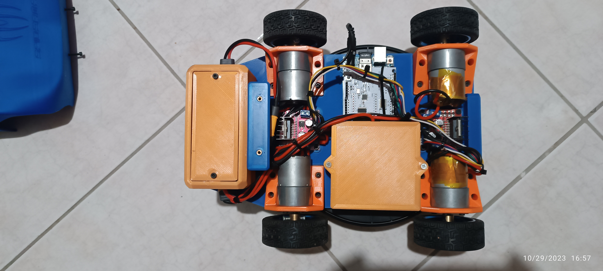

# Arduino Uno Rover with PS4 Controller

 

This project showcases an Arduino Uno-based rover with a PS4 controller interface. The rover boasts four 65mm rubber wheels, driven by four JGB370-3530 brushed geared motors and controlled by dual L298N motor drivers. It runs on four 18650 Li-Ion batteries with a 4S BMS, ensuring ample power for all its electronic components for approximately 15-25 minutes on a single charge.

## Features

- **PS4 Controller Integration:** Control the rover via Bluetooth using a PS4 controller, enabled by the Arduino USB host shield and a Bluetooth dongle.  
- Support for various control **modes:**
  - **Car mode:** Control a car-like rover using joysticks.
  - **Car mode with triggers:** Control a car-like rover using triggers and the left joystick.
  - **Car mode with accelerometers:** Control a car-like rover using triggers for throttle and the accelerometer for steering.
  - **Funky car mode:** Control a unique car-like rover using the accelerometer for both throttle and steering.
  - **Tank mode:** Control a tank-like robot with separate control for each side using joysticks.
- **Turbo mode:** Activate turbo mode for max speed.
- **Speed mode:** Adjust the robot's speed on the fly. (doesn't apply to the turbo mode)
- **LED and Rumble feedback:** Indicate the current control mode and turbo mode using LED and rumble feedback on the PS4 controller.
- **3D-Printed Chassis:** The project includes 3D-printed chassis and shell models, designed with Fusion 360. These models are conveniently divided into parts for easier printing and assembly.

## Getting Started

To build and operate this project, follow these steps:

1. Assemble the rover chassis and shell using the 3D-printed parts provided in the [3D_Models](3D_Models/Printed_Parts) directory.

2. Connect the motors to the L298N motor drivers.

3. Ensure that the L298N motor drivers receive the correct power supply: raw voltage from the 4S BMS (>12V) and additional 5V voltage from a dc-to-dc step-down buck converter.

4. Set up the Arduino Uno with the required libraries and connect the Arduino USB host shield and Bluetooth dongle.

5. Upload the provided [Arduino sketch](AWD_PS4_RC/AWD_PS4_RC.ino) to the Arduino Uno.

6. Confirm that the Arduino Uno is powered with 12V from an individual dc-to-dc step-down buck converter.
   
7. Pair your PS4 controller with the Bluetooth dongle.
   
8. Power on the rover and start controlling it with your PS4 controller.   

## Usage

1. Control Modes:
   - Press the "Options" OR "Share" button to cycle through different control modes.
   - Control the robot based on the selected mode using the PS4 controller's buttons, joysticks, and triggers.

2. Turbo Mode:
   - Activate turbo mode by pressing specific button sequences on the controller (e.g., L1 + R1 + Triangle + Left).
   - Turbo mode increases the robot's speed.

3. Speed Mode:
   - Adjust the robot's speed by pressing the "Up" and "Down" buttons on the controller.

4. LED Feedback:
   - The LED on the PS4 controller provides feedback on the current control mode and turbo mode status.
     
## License

This project is licensed under the GNU GENERAL PUBLIC LICENSE - see the [LICENSE](https://github.com/Obrelix/Arduino-Uno-Rover-with-PS4-Controller/blob/main/LICENSE) file for details.

## Acknowledgments

- This project owes its existence to the contributions of the open-source Arduino community and the PS4BT library for Arduino.

- Special thanks to my collaborators, Kostas Vrailas and Thomas Vasiliou, who joined forces to create this project as a delightful gift for Kostas's young son.

Feel free to contribute, enhance, or customize this project as needed. If you have questions or feedback, please open an issue or get in touch with us.

Happy roving! 🚀

## Images

