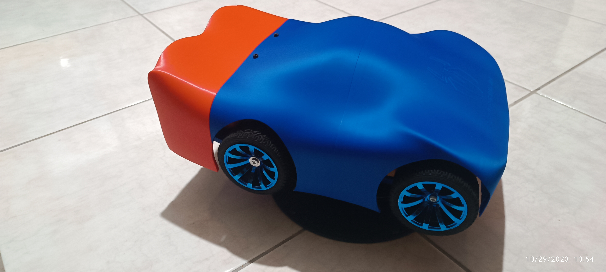

# Arduino Uno Rover with PS4 Controller

This project showcases an Arduino Uno-based rover with an innovative PS4 controller interface. The rover boasts four 65mm rubber wheels, driven by four JGB370-3530 brushed geared motors and controlled by dual L298N motor drivers. It runs on four 18650 Li-Ion batteries with a 4S BMS, ensuring ample power for all its electronic components.

## Key Features

- **PS4 Controller Integration:** Effortlessly control the rover via Bluetooth using a PS4 controller, enabled by the Arduino USB host shield and a Bluetooth dongle.

- **Versatile Control Modes:** Choose from various control modes, including tank mode, joystick-controlled car mode, trigger and joystick-controlled car mode, trigger and accelerometer-controlled car mode, and a whimsical car mode for added entertainment.

- **Turbo Mode:** Unleash the full potential of the rover's motors for thrilling performance by maximizing the PWM signal that controls motor speed. Use this feature with caution.

- **3D-Printed Chassis:** The project includes 3D-printed chassis and shell models, designed with Fusion 360. These models are conveniently divided into parts for seamless printing and assembly.

## Getting Started

[BOM](https://github.com/Obrelix/Arduino-Uno-Rover-with-PS4-Controller/blob/main/LICENSE)

To build and operate this project, follow these steps:

1. Assemble the rover chassis and shell using the 3D-printed parts provided in the `3D_Models` directory.

2. Connect the motors to the L298N motor drivers.

3. Ensure that the L298N motor drivers receive the correct power supply: raw voltage from the 4S BMS (>12V) and additional 5V voltage from a dc-to-dc step-down buck converter.

4. Set up the Arduino Uno with the required libraries and connect the Arduino USB host shield and Bluetooth dongle.

5. Upload the provided Arduino sketch to the Arduino Uno.

6. Pair your PS4 controller with the Bluetooth dongle.

7. Confirm that the Arduino Uno is powered with 12V from an individual dc-to-dc step-down buck converter.

8. Power on the rover and start controlling it with your PS4 controller.

## Usage

- To switch between different control modes, use the "Options" and "Share" buttons on your PS4 controller.

- Activate or deactivate "Turbo Mode" by simultaneously pressing the "R1," "L1," "TRIANGLE," and "DOWN" buttons on your PS4 controller.

- Monitor on-screen LED color changes on your PS4 controller to determine the current control mode and turbo mode status.

- Enjoy exploring the capabilities of your Arduino Uno rover!

## License

This project is licensed under the GNU GENERAL PUBLIC LICENSE - see the [LICENSE](https://github.com/Obrelix/Arduino-Uno-Rover-with-PS4-Controller/blob/main/LICENSE) file for details.

## Acknowledgments

- This project owes its existence to the contributions of the open-source Arduino community and the PS4BT library for Arduino.

- Special thanks to my collaborators, Kostas Vrailas and Thomas Vasiliou, who joined forces to create this project as a delightful gift for Kostas's young son.

Feel free to contribute, enhance, or customize this project as needed. If you have questions or feedback, please open an issue or get in touch with us.

Happy roving! 🚀
## Images

